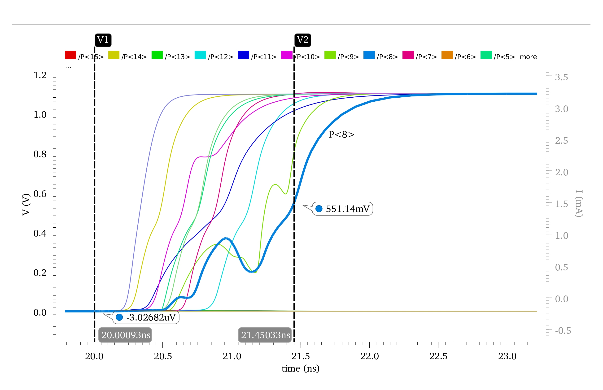

# 8-Bit Wallace Tree Multiplier and MAC Module

This repository contains the implementation of an **8-bit Wallace Tree Multiplier** and a **Multiply-and-Accumulate (MAC) module** using **45nm CMOS technology** in **Cadence Virtuoso**.

## Features

- **8-bit Wallace Tree Multiplier**:  
  Implemented using **4:2 compressors** for partial product reduction and a **final Carry Look-Ahead Adder** to optimize the multiplication process.

- **MAC Module**:  
  The MAC module integrates the **Wallace Tree Multiplier** with a **Parallel Input Parallel Output (PIPO)** shift register acting as an accumulator. The accumulator is designed using **D Flip-Flops** for efficient storage of each bit's value.

The project aims to provide a high-speed and energy-efficient implementation of the Wallace Tree Multiplier and MAC unit, suitable for applications in **digital signal processing** and other computational systems.

## Technologies

- **45nm CMOS technology**
- **Cadence Virtuoso** for schematic design and simulation and layout

## Topology selection for different circuit elements

We have used $45~nm$ CMOS technology to implement the primitive gates. Additionally, we have used CMOS as well as transmission based logic to based design our ciruits as explained below. 

- **NAND, NOR and NOT gates**
The primitive gates like NAND, NOR and NOT are designed using standard CMOS logic with NMOS and PMOS transistors. CMOS gates offer full rail-to-rail output, high noise margin and low power consumption. Hence, they are preferred for the design of these primitive gates.

- **XOR gate and 2:1 Multiplexer**
The XOR gate and 2:1 MUX are designed using transmission gates since they require fewer number of transistors as compared to CMOS based logic. Additionally, transmission gates have minimal leakage and static power dissipation during steady states. Hence, we have used transmission based design for XOR and 2:1 MUX.


## 8-bit Wallace Tree Multiplier Architecture

The schematic of the 8-bit Wallace tree multiplier implemented using 4:2 compressors is shown below. The 4:2 compressors are used in Stage 1 and Stage 2, along with full adders and half adders for partial product reduction. In the final stage, a 12-bit Carry Look-ahead Adder (CLA) is used to generate the output product.

### Circuit Diagram


## Partial Product Generator

The Partial Product Generator produces the partial product for each bit of the multiplier and the multiplicand using the AND operation. Using two 8-bit inputs, a total of 64 partial products are obtained, which are given as inputs to the proceeding circuits for partial product reduction. 


Each block in the Partial Product Generator consists of an array of 8 AND gates, which generate the partial products from $A_i \cdot B_0$ to $A_i \cdot B_7$. We have used 8 such blocks to generate the partial products for all 64 combinations of the input bits.


## 4:2 Compressor Design

A 4:2 compressor is a critical component in arithmetic circuits, particularly in multipliers, where it efficiently compresses multiple partial product bits. It takes four input bits $A_1$, $A_2$, $A_3$, $A_4$ and an additional carry input bit $C_{in}$ from the previous column. It compresses these inputs to produce two outputs: $Sum$ and $Carry$, along with an intermediary carry bit $C_{out}$. The intermediary $C_{out}$ serves as the carry input $C_{in}$ for the next column.

### Input-Output Relationship

The relationship between the inputs and outputs of the 4:2 compressor is expressed mathematically as:

$$
A_1 + A_2 + A_3 + A_4 + C_{in} = Sum + 2(Carry + C_{out})
$$

Here, $Carry$ and $C_{out}$ represent outputs with a significance of 1 bit higher than the five input bits $A_1$, $A_2$, $A_3$, $A_4$, and $C_{in}$.

### Key Characteristics

In contrast to a full adder, where both $Sum$ and $C_{out}$ are influenced by $C_{in}$ from the previous stage, a 4:2 compressor decouples $C_{out}$ from $C_{in}$. This decoupling allows parallel computation of carry outputs, significantly reducing the overall propagation delay.


### Implementation

We have implemented the first design of the 4:2 compressor proposed by Priyadharshni et al. [1]. The circuit design minimizes the number of XOR gates to 3, compared to the 4 XOR gates used in traditional compressors. Additionally, 2:1 multiplexers (MUX), constructed using transmission gates, further reduce delay.

### Circuit Diagram


### Interim Signals

Two interim signals, $S_i$ and $Condition$, are calculated as follows:

$$
S_i = A_1 \oplus A_2 \oplus A_3
$$

$$
Condition = A_4 \oplus C_{in}
$$

### Output Expressions

The outputs $Sum$, $Carry$, and $C_{out}$ are derived using the following equations:

1. **Sum**: 

$$
Sum = \overline{S_i}(A_4 \oplus C_{in}) + S_i(A_4 \odot C_{in})
$$

2. **Carry**:

$$
Carry = (A_4 \oplus C_{in}) C_{in} + (A_4 \odot C_{in}) S_i
$$

3. **Carry Out ($C_{out}$)**:

$$
C_{out} = \overline{\overline{(A_1 A_2)} \cdot \overline{(A_2 A_3)} \cdot \overline{(A_1 A_3)}}
$$

### Optimization

- **XOR Gate Reduction**: The design uses 3 XOR gates, improving efficiency over traditional designs with 4 XOR gates.
- **MUX-Based Logic**: MUX logic optimizes the expressions for $Sum$ and $Carry$, reducing delay.
- **Dual-Stage NAND Model**: A dual-stage NAND model is utilized for generating $C_{out}$, further enhancing speed and area efficiency.


## Carry Look-ahead Adder

In the last stage of our Wallace tree multiplier design, we use three cascaded 4-bit Carry Look-ahead (CLA) adders to form a 12-bit Carry Look-ahead adder. Unlike other adder topologies like the Ripple Carry adder, a Carry Look-ahead adder computes carry signals in parallel using generate and propagate logic, eliminating the delay caused by sequential carry propagation. The expressions for the propagate signal $P_i$ and the generate signal $G_i$ are given in equations below:

$$
P_i = A_i \oplus B_i
$$

$$
G_i = A_i \cdot B_i
$$

These signals are used to generate the \$Sum$ and $Carry$ for the CLA adder as given below:

$$
S_i = P_i \oplus C_i
$$

$$
C_{i+1} = G_i + P_i \cdot C_i
$$

---

## Functional Verification and Simulation Results
The schematic of our Wallace tree multiplier as implemented in $Cadence~Virtuoso$ is shown in below figure.


To perform functional verification of our design, we have implemented a test bench circuit where the Wallace tree multiplier is powered with a $1.1 V$ supply, and all the outputs are connected to $2 fF$ capacitors. The rise/fall time of all the input bits is set to $50 ps$.

The waveform for different input combinations and the corresponding outputs are shown in figure. We have verified our outputs for the input combinations.

 


## Latency, Energy and Area Analysys

### Worst Case Propagation Delay and Corresponding Input

The propagation delay is measured for the time taken by the input to transition to 50% of $V_{dd}$ to the time taken by the output to stabilize to 50% of $V_{dd}$. The worst-case propagation delay depends on several factors like the critical path for the output signal, transistor sizing, layout implementation, parasitic capacitance and resistance extracted from the layout, interconnect capacitance and resistance, power supply, signal crosstalk, and so on.

 

The maximum propagation delay of our Wallace tree multiplier arises from the output bit $P(8)$ as shown clearly in above graph. We can also see from Wallace tree architecture that $P(8)$ occurs approximately in the middle of our Wallace tree architecture, hence it typically encounters the most number of carries and additions due to overlapping partial products. The bit $P(8)$ becomes high for the input $A = 157$ and $B = 156$. The maximum delay for this combination is $1.42482~ns$.


### Energy Analysis

Using our worst-case input pair having $A = 157$ and $B = 156$, we calculate the maximum energy consumption for our design, which comes out to be around **$609.038~fJ$**, as verified from below graph.


### Layout and Total Area

The layout of the Wallace tree multiplier circuit is shown below. The total area of our layout is approximately **$1916.571525~\mu m^2$**.


Our layout has successfully passed DRC and LVS checks. After designing the layout, we perform parasitic extraction for energy and latency analysis.

## Summary of Results for Wallace Tree Multiplier

A summary of our Energy-Delay-Area analysis is shown in Table 1.

| **Area** ($\mu m^2$) | **Delay** ($ns$) | **Energy** ($fJ$) |
|----------------------|----------------|-----------------|
| 1916.571525          | 1.42482        | 609.038         |

**Table 1:** Summary of results for Wallace tree multiplier.

### Variation of Energy and Delay with Power Supply

By varying the supply voltage from $1 V$ to $1.2 V$, we have calculated the values of Energy, Delay, and Energy-Delay Product (EDP) as depicted in Table 2. From this table, we can see that EDP is minimum at $1.2~V$.


| **Supply Voltage** ($V$) | **Energy** ($fJ$) | **Delay** ($ns$) | **EDP** ($ns × fJ$) |
|------------------------|-----------------|----------------|-------------------|
| 1.0                    | 495.1           | 1.74           | 861.47            |
| 1.1                    | 609.04          | 1.42           | 864.83            |
| 1.2                    | 732.0           | 1.16           | 849.12            |

**Table 2:** Variation of energy and delay with power supply.


# Report

For a detailed explanation and documentation of the implementation, please refer to the [Project Report PDF](./Project_Report_EEE559.pdf).

---

# References

1. Hasini, PNVK, and T Krishna Murthy. "A Novel high-speed transistorized 8x8 Multiplier using 4-2 Compressors." *International Journal of Engineering Research and General Science*, vol. 3, no. 2, 2015, pp. 359–365. [Citeseer](https://www.citeseerx.ist.psu.edu/viewdoc/summary?doi=10.1.1.947.3479).

2. Wallace, Christopher S. "A suggestion for a fast multiplier." *IEEE Transactions on Electronic Computers*, no. 1, 1964, pp. 14–17. [IEEE Xplore](https://ieeexplore.ieee.org/document/4081423).

3. Priyadharshni, M, Anishchandran Chathalingathu, S Kumaravel, Arun Manoharan, Sreehari Veeramachaneni, and Sk Noor Mahammad. "Logically optimal novel 4:2 compressor architectures for high-performance applications." *Arabian Journal for Science and Engineering*, vol. 45, 2020, pp. 6199–6209. [Springer](https://link.springer.com/article/10.1007/s13369-020-04425-1).

4. Kumar, Manish, and Jonali Nath. "Design of an energy efficient 4-2 compressor." *IOP Conference Series: Materials Science and Engineering*, vol. 225, no. 1, 2017, p. 012136. [IOP Publishing](https://iopscience.iop.org/article/10.1088/1757-899X/225/1/012136).

5. Kumar, Maroju Sai, D Ashok Kumar, and P Samundiswary. "Design and performance analysis of Multiply-Accumulate (MAC) unit." *2014 International Conference on Circuits, Power and Computing Technologies [ICCPCT-2014]*, IEEE, 2014, pp. 1084–1089. [IEEE Xplore](https://ieeexplore.ieee.org/document/7026864).

6. Sung, Guo-Ming, Chong-Cheng Huang, Xiong Xiao, and Shih-Ying Hsu. "10-Bit 5 MS/s Successive Approximation Register Analog-to-Digital Converter with a Phase-Locked Loop and Modified Bootstrapped Switch for a BLDC Motor Drive." *Electronics*, vol. 11, no. 4, 2022, p. 624. [MDPI](https://www.mdpi.com/2079-9292/11/4/624).


# Installation

1. Clone the repository:
   ```bash
   git clone https://github.com/vishalkevat007/8-bit-Wallace-Tree-Multiplier-and-MAC-Unit.git
